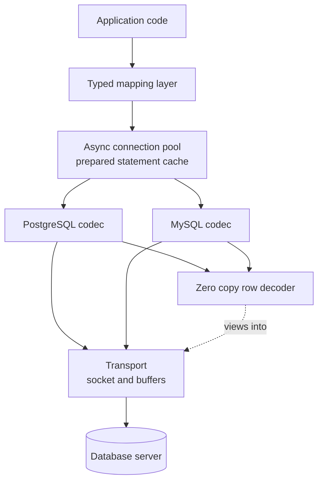

# Conduit

A C++20 database client library that speaks the PostgreSQL and MySQL wire protocols directly.
Course project for **Advanced Database Technologies**, MEng in Computer and Software Engineering,
Faculty of Computer Systems and Technologies, Technical University of Sofia.

## What it is

Conduit connects to PostgreSQL and MySQL by implementing their published network protocols
itself, instead of linking against the vendor client libraries or going through an ODBC driver
manager. Removing those layers makes the cost of database access visible: every buffer copy,
every round trip and every serialisation step is code in this repository rather than behaviour
hidden behind someone else's API. The library provides an asynchronous connection pool, a
prepared statement cache and a zero copy row decoder, and it is to be measured against `libpq`
and `libmysqlclient` on the same workload. No measurement has been taken yet.

## Goals

- Implement the PostgreSQL frontend/backend protocol from its specification, covering the simple
  and the extended query cycles.
- Implement the MySQL client/server protocol from its specification, covering handshake, text
  and binary result sets.
- Decode result rows without copying out of the receive buffer, with the lifetime rule stated in
  the public contract.
- Provide an asynchronous connection pool built on C++20 coroutines, with no thread per connection.
- Cache prepared statements per connection and measure the effect on round trip count.
- Compare latency, throughput, memory and round trips against `libpq` and `libmysqlclient` on one
  identical workload.

## Technologies

| Technology | Version or standard | Why |
|---|---|---|
| C++20 | ISO/IEC 14882:2020 | Coroutines carry the async model, concepts express the shared codec contract without virtual dispatch |
| `std::span`, `std::string_view` | C++20 standard library | The carriers for zero copy row decoding, no extra dependency needed |
| CMake | 3.25 or newer | Standard build system for C++ libraries, needed for the multi target layout |
| GoogleTest | 1.14 or newer | Unit and integration tests, widely available and already known |
| PostgreSQL wire protocol | Version 3.0 | The protocol implemented directly, publicly specified |
| MySQL client/server protocol | `Protocol::HandshakeV10` | The second protocol implemented directly, publicly specified |
| Docker Compose | v2 | Pins server versions so integration tests and measurements are reproducible |
| `libpq`, `libmysqlclient` | System packages | Baselines for the comparison, never a runtime dependency of the library |

## Architecture

Five layers with one directional dependency. The transport owns the socket and the buffers and
knows nothing about message content. Above it sit two independent protocol codecs, one per
database, sharing no base class but satisfying the same concept. The row decoder turns a message
body into views into the receive buffer. The connection pool owns connection lifetime and the
per connection prepared statement cache. The typed mapping layer binds protocol values to C++
types, checked at compile time.



## Build

```bash
cmake -S . -B build -DCMAKE_BUILD_TYPE=Release
cmake --build build -j

# unit tests only, no server required
ctest --test-dir build -L unit

# integration tests, requires the compose environment to be up
docker compose up -d
ctest --test-dir build -L integration
```

The build files and the compose environment land in the next pass. This repository currently
holds the scaffold and the documentation.

## Documentation

The project report lives in `docs/` and is written in Bulgarian, because the subject is taught in
Bulgarian and the formatting rules of the Faculty of Computer Systems and Technologies are
normative. It follows the faculty format: A4, Times metrics at 12pt, 1.5 line spacing, Roman
numbered sections, tables captioned above and figures captioned below.

```bash
cd docs
latexmk -pdf Main.tex   # output lands in docs/build/Main.pdf
```

Unfilled facts are marked with `\TODO{...}` and can be listed with:

```bash
grep -rn 'TODO' docs/chapters docs/Main.tex docs/references.bib
```

## Status

- [x] Repository scaffold
- [x] Report skeleton in `docs/`, all nine chapter files present
- [x] Bibliography with verifiable sources
- [ ] CMake build
- [ ] Transport layer
- [ ] PostgreSQL codec
- [ ] MySQL codec
- [ ] Zero copy row decoder
- [ ] Async connection pool
- [ ] Prepared statement cache
- [ ] Typed mapping layer
- [ ] Docker Compose environment
- [ ] Unit tests
- [ ] Integration tests against both servers
- [ ] Benchmark harness
- [ ] Measurements against `libpq` and `libmysqlclient`
- [ ] Results chapter filled in

Nothing in the results chapter is measured yet. Every number there is a `\TODO` marker on purpose.

## License

MIT. See [LICENSE](LICENSE).
