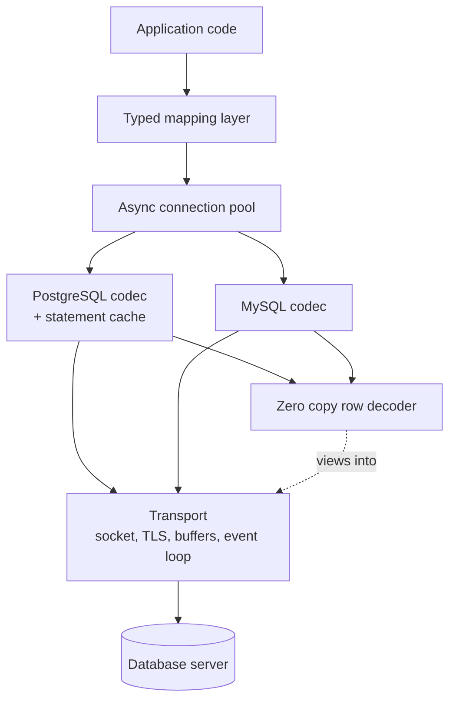

# Conduit

A C++20 database client library that speaks the PostgreSQL and MySQL wire protocols directly.
Course project for **Advanced Database Technologies**, MEng in Computer and Software Engineering,
Faculty of Computer Systems and Technologies, Technical University of Sofia.

## What it is

Conduit connects to PostgreSQL and MySQL by implementing their published network protocols
itself, instead of linking against the vendor client libraries or going through an ODBC driver
manager. Removing those layers makes the cost of database access visible: every buffer copy,
every round trip and every serialisation step is code in this repository rather than behaviour
hidden behind someone else's API. The library provides an asynchronous connection pool, a
prepared statement cache and a zero copy row decoder, and it carries a message trace that reports
exactly which protocol messages a query cost.

**No mandatory third-party dependencies.** A C++20 compiler and CMake are enough. Nothing is
fetched at configure time. The test runner, the timing harness and the hash functions the two
authentication exchanges need are all in this repository.

## What is implemented

| Area | State |
|---|---|
| PostgreSQL protocol 3.0: startup, simple query flow | done |
| PostgreSQL extended flow: Parse, Bind, Describe, Execute, Sync, Close | done |
| PostgreSQL authentication: trust, cleartext, MD5, SCRAM-SHA-256 | done |
| PostgreSQL type decoding, text and binary | int2/4/8, float4/8, bool, text, bytea, timestamp, numeric, 1-D arrays |
| MySQL protocol: HandshakeV10, `mysql_native_password`, auth switch | done |
| MySQL text protocol query flow, `COM_QUERY`, `COM_PING`, `COM_QUIT` | done |
| C++20 coroutine layer: `task<T>`, event loop, awaitable socket, timers | done |
| Connection pool: bounded, acquire with timeout, health check, direct handoff | done |
| Prepared statement cache: per connection, LRU, close on eviction, retry on 26000 | done |
| Typed row mapping with compile time field binding | done |
| Protocol message trace and round trip counting | done |
| TLS: PostgreSQL `SSLRequest`, MySQL `CLIENT_SSL` / `SSLRequest` | done, optional system OpenSSL |
| Integration tests against real servers via Docker Compose | done, 14 cases |
| `COPY`, `LISTEN`/`NOTIFY`, MySQL binary prepared statements, `caching_sha2_password` | out of scope, reported with a clear error |

## Technologies

| Technology | Version or standard | Why |
|---|---|---|
| C++20 | ISO/IEC 14882:2020 | Coroutines carry the async model, concepts express the shared codec contract without virtual dispatch |
| `std::span`, `std::string_view` | C++20 standard library | The carriers for zero copy row decoding, no extra dependency needed |
| CMake | 3.20 or newer | Standard build system for C++ libraries, needed for the multi target layout |
| PostgreSQL wire protocol | Version 3.0 | The protocol implemented directly, publicly specified |
| MySQL client/server protocol | `Protocol::HandshakeV10` | The second protocol implemented directly, publicly specified |
| Docker Compose | v2 | Pins server versions so integration tests and measurements are reproducible |
| `libpq` | optional, system package | Baseline for the benchmark only. Found with `find_package(... QUIET)`; the benchmark reports its absence and measures nothing rather than guessing |
| OpenSSL | optional, system package | TLS for both wire protocols. Found with `find_package(OpenSSL QUIET)`; if it is absent the library builds without TLS, requesting TLS is a clear error, and the tests skip rather than guessing |

The test runner is `tests/check.hpp`, 170 lines, registered with CTest through `add_test`.
There is no GoogleTest and no Google Benchmark: a build that needs a package manager is a build
nobody runs.

## Architecture

Five layers with one directional dependency. The transport owns the socket and the buffers and
knows nothing about message content. Above it sit two independent protocol codecs, one per
database, sharing no base class but satisfying the same concept (`conduit::frame_codec`, checked
with a `static_assert` in each). The row decoder turns a message body into views into the receive
buffer. The connection pool owns connection lifetime, and each connection owns its prepared
statement cache. The typed mapping layer binds protocol values to C++ types, checked at compile
time.



## Build

Verified on Windows 11 with g++ 15.2.0 (MinGW-w64), CMake 4.3.2 and Ninja 1.13.2.

```bash
cmake -S . -B build -G Ninja -DCMAKE_BUILD_TYPE=Release
cmake --build build
```

`-G Ninja` is a preference, not a requirement; the default generator works too.

## Test

```bash
# unit cases, no server needed
ctest --test-dir build -L unit

# integration cases against real servers, including TLS
docker compose up -d
ctest --test-dir build -L integration

# everything; the integration binary skips and still exits zero when no server is up.
# TLS cases skip when OpenSSL was not found at configure time, and say so.
ctest --test-dir build --output-on-failure
```

## Run the demo

One command, both backends. It connects, creates a table, inserts rows, runs a parameterised
query through the extended protocol, prints the decoded typed results, and prints the protocol
message trace for every step.

```bash
docker compose up -d
cmake --build build --target demo
```

Or run the binary directly: `./build/examples/conduit_demo`. An excerpt of what it prints:

```
  extended query, first execution (Parse, Describe, Bind, Execute, Sync), binary results:
    -> Parse  (101 B)  conduit_s1: SELECT id, sensor, reading, valid FROM ...
    -> Describe  (17 B)  statement conduit_s1
    -> Bind  (37 B)  1 parameters, binary results
    -> Execute  (10 B)  unlimited rows
    -> Sync  (5 B)
    <- ParseComplete  (5 B)
    <- ParameterDescription  (11 B)  1 parameters
    <- RowDescription  (103 B)  4 columns
    <- BindComplete  (5 B)
    <- DataRow  (45 B)
    <- CommandComplete  (14 B)  SELECT 2
    <- ReadyForQuery  (6 B)  I
    round trips: 1

  same SQL again: the statement cache skips Parse and Describe
    -> Bind  (38 B)  1 parameters, binary results
    -> Execute  (10 B)  unlimited rows
    -> Sync  (5 B)
    ...
```

Connection details default to the ports in `docker-compose.yml` and can be overridden with
`CONDUIT_PG_HOST`, `CONDUIT_PG_PORT`, `CONDUIT_PG_USER`, `CONDUIT_PG_PASSWORD`,
`CONDUIT_PG_DATABASE` and the matching `CONDUIT_MYSQL_*` variables.

## Measure

```bash
docker compose up -d
cmake --build build --target bench
# or, with the raw per repetition samples written to benchmarks/results/raw_samples.csv
./build/benchmarks/conduit_bench --raw --rows=5000
```

The benchmark measures simple against extended query flow, the effect of the statement cache on
both wall time and message count, pool acquisition latency across pool size and concurrency, and
text against binary decode throughput. It compares against `libpq` when `libpq` is installed, and
says so explicitly when it is not.

Every number in the report was produced by this program on the machine described in the report;
nothing is estimated.

`benchmarks/results/` is not in this tree: Docker was not available in the environment that
added TLS, so the harness was not run again. The numbers already in the report are the ones
from the earlier measured runs. They were not invented and they were not rewritten.

## Documentation

The project report lives in `docs/` and is written in Bulgarian, because the subject is taught in
Bulgarian and the formatting rules of the Faculty of Computer Systems and Technologies are
normative. It follows the faculty format: A4, Times metrics at 12pt, 1.5 line spacing, Roman
numbered sections, tables captioned above and figures captioned below.

```bash
cd docs
latexmk -pdf Main.tex   # output lands in docs/build/Main.pdf
```

`latexmk` exits zero even when the bibliography silently fails, so check `docs/build/Main.blg`
for the line `You've used N entries` and compare N against `references.bib`.

Unfilled facts are marked with `\TODO{...}` and can be listed with:

```bash
grep -rn 'TODO' docs/chapters docs/Main.tex docs/references.bib
```

## Status

- [x] Repository scaffold
- [x] Report in `docs/`, all nine chapter files written
- [x] Bibliography with verifiable sources
- [x] CMake build, no mandatory dependencies
- [x] Transport layer and C++20 coroutine event loop
- [x] PostgreSQL codec, both query flows, four authentication methods
- [x] MySQL codec, handshake and text protocol
- [x] Zero copy row decoder, text and binary
- [x] Async connection pool with timeout, health check and direct handoff
- [x] Prepared statement cache with eviction and invalidation
- [x] Typed mapping layer with compile time field binding
- [x] Docker Compose environment, PostgreSQL 16.4 and MySQL 8.0.39
- [x] Unit tests, 91 cases
- [x] Integration tests against both servers, 14 cases
- [x] Benchmark harness
- [x] Results chapter filled in with measured numbers
- [x] Comparison against `libpq` and `libmysqlclient`: measured. Not on the Windows machine the
      rest of the report was measured on, where neither library is installed, but in a Debian
      container built by `Dockerfile.bench`, where conduit and both vendor libraries run in the
      same process against the same servers. Reproduce with `docker compose run --rm --build bench`.
      Those numbers are comparable with each other and **not** with the host tables.
- [x] Peak memory measurement: implemented. Peak working set on Windows, `VmHWM` on Linux,
      reported for the whole run. 7.7 MiB on the host, 11.7 MiB in the container.
- [x] **Two defects, both found by this measurement, both fixed.**
      1. `read_message()` (PostgreSQL) and `read_packet()` (MySQL) were coroutines invoked once
         per protocol message, including the common case where a whole message was already in the
         receive buffer. The resumption chain grew the stack once per message instead of unwinding
         it, so a 5000 row result exhausted it. GCC 12.2 died with SIGSEGV; GCC 14.2 tolerated the
         same source. A compiler bug was ruled out by measurement: `benchmarks/symmetric_transfer_check.cpp`
         does 200,000 symmetric transfers at `-O2` on GCC 12.2 without growing the stack. Both are
         now awaitables whose `await_ready()` does the peek, so the common case suspends nothing
         and allocates nothing. The coroutine survives as `*_slow()`, entered once per socket read.
      2. The pool's acquire-timeout callback captured the waiter by `shared_ptr`. Nothing cancels
         that callback when a slot is granted normally, so it outlived the waiter and AddressSanitizer
         reported a heap-use-after-free. It now holds a `weak_ptr` and locks it.
      Verified: GCC 12.2 Release completes where it used to crash, GCC 14.2 completes, the host
      MinGW build completes with `ctest` 2 of 2 green, and ASan reports no error (it needs a 128 MB
      stack to finish, because the sanitizer's own frame instrumentation overflows the default 8 MB).
- [x] TLS, via system OpenSSL (`find_package(OpenSSL QUIET)`). A build without it still compiles;
      requesting TLS is a clear error, and the tests skip rather than guessing. GitHub Actions
      runs the unit job always; integration and live TLS only on the job that starts the
      compose servers.

## License

MIT. See [LICENSE](LICENSE).
